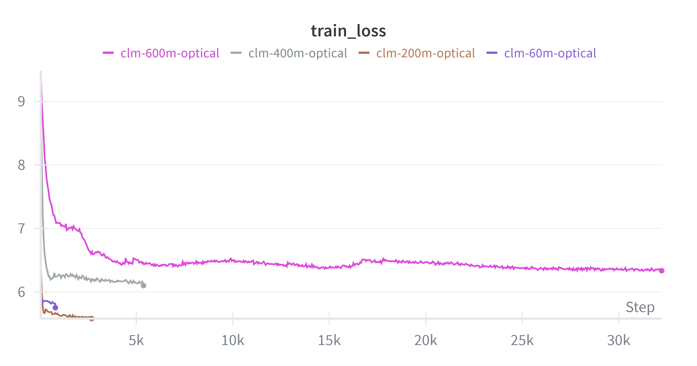

Scaling Optical Transformers to Causal Language Models
=======================================================

Following the :doc:`onn_roberta` experiments, we scale the Optical Transformer to
causal language models (CLMs). This tutorial demonstrates full fine-tuning of a
pretrained CLM with Mase-triton acceleration.

.. note::

   If you have not set up the environment yet, follow :doc:`../../getting_started/installation` first.

Starting Points Explored
------------------------

We evaluated three starting points before settling on the main approach:

.. list-table::
   :header-rows: 1
   :widths: 35 40 25

   * - Starting point
     - Observation
     - Code
   * - Pretraining from scratch
     - Training loss did not decrease.
     - `link <https://github.com/AICrossSim/NewComputeBench/blob/master/experiments/llm-optical-transformer/pretrain>`_
   * - LoRA fine-tuning of a pretrained CLM
     - Training loss decreased only for the 60M model.
     - `link <https://github.com/AICrossSim/NewComputeBench/blob/master/experiments/llm-optical-transformer/lora_finetuning>`_
   * - **Full fine-tuning of a pretrained CLM** ✅
     - Training loss decreases with a small learning rate (< 1e-5).
     - `link <https://github.com/AICrossSim/NewComputeBench/blob/master/experiments/llm-optical-transformer/continual_finetuning>`_

Full Fine-Tuning with Optical Transformer
------------------------------------------

Entry point:
`experiments/llm-optical-transformer/continual_finetuning/run_clm_no_trainer.py <https://github.com/AICrossSim/NewComputeBench/blob/master/experiments/llm-optical-transformer/continual_finetuning/run_clm_no_trainer.py>`_

Optical Transformer configuration
~~~~~~~~~~~~~~~~~~~~~~~~~~~~~~~~~~~

The optical transformer is configured through a TOML file
(`experiments/llm-optical-transformer/continual_finetuning/transform_cfg.toml <https://github.com/AICrossSim/NewComputeBench/blob/master/experiments/llm-optical-transformer/continual_finetuning/transform_cfg.toml>`_):

- ``use_lora`` — set to ``false`` for full fine-tuning
- ``attention.q_levels`` — quantization levels (default: 256)
- ``attention.q_lut_min`` — minimum LUT value (default: 0.020040)
- ``attention.q_smooth_factor`` — smoothing factor for running statistics (default: 0.9)
- ``attention.q_init_seed`` — random seed (default: 0)
- ``attention.q_bypass`` — bypass quantization in attention layers (default: false)
- ``fc`` — same parameters apply to fully-connected layers

Training setup
~~~~~~~~~~~~~~

.. list-table::
   :header-rows: 1
   :widths: 30 70

   * - Setting
     - Value
   * - Pretrained model
     - ``AICrossSim/clm`` series
   * - Dataset
     - ``Cheng98/fineweb-edu-1.25B`` (1.25B-token subset of CLM pretraining data)
   * - Fine-tuning tokens
     - ``22 × N_params / 100``
   * - Learning rate
     - Sweep from 1e-7 to 1e-5 depending on model size. Larger models require smaller rates.
   * - Effective batch size
     - 16 (via gradient accumulation steps and number of processes)

Basic fine-tuning command
~~~~~~~~~~~~~~~~~~~~~~~~~~

.. code-block:: bash

   accelerate launch --num_processes=1 \
       run_clm_no_trainer.py \
       --model_name_or_path "AICrossSim/clm-60m" \
       --dataset_name "Cheng98/fineweb-edu-1.25B" \
       --per_device_train_batch_size 8 \
       --learning_rate 2e-5 \
       --weight_decay 0.01 \
       --num_train_epochs 1 \
       --gradient_accumulation_steps 2 \
       --lr_scheduler_type linear \
       --output_dir "./output/clm-60m-optical" \
       --preprocessing_num_workers 32 \
       --trust_remote_code \
       --with_tracking \
       --report_to wandb \
       --transform_cfg ./transform_cfg.toml \
       --block_size 1024 \
       --log_train_loss_steps 50

.. warning::

   **Learning rate is critical.** Optical Transformer fine-tuning requires a very small
   learning rate (< 1e-5) for stable training. Larger learning rates cause loss divergence.
   The larger the model, the smaller the required learning rate.

   .. figure:: ../../../../_static/images/onn/onn-clm-400m-failed.png
      :width: 600px
      :alt: CLM-400M loss divergence with high learning rate

      CLM-400M with learning rate too high — loss diverges.

Using the shell script
~~~~~~~~~~~~~~~~~~~~~~~

`fine-tune-ot-clm.sh <https://github.com/AICrossSim/NewComputeBench/blob/master/experiments/llm-optical-transformer/continual_finetuning/fine-tune-ot-clm.sh>`_
automatically calculates training steps and configures W&B logging:

.. code-block:: bash

   # Default parameters
   ./fine-tune-ot-clm.sh

   # Custom parameters
   # Usage: ./fine-tune-ot-clm.sh [num_processes] [model_name_or_path]
   #        [per_device_train_batch_size] [learning_rate] [weight_decay]
   #        [gradient_accumulation_steps] [block_size]
   ./fine-tune-ot-clm.sh 2 "AICrossSim/clm-200m" 4 "1e-5" 0.01 4 1024

Learning rate sweep
~~~~~~~~~~~~~~~~~~~~

.. code-block:: bash

   # Edit sweep.sh to set desired learning rate ranges, then run:
   ./sweep.sh

Results
-------

   Training loss for full fine-tuning across CLM model sizes (traces smoothed for clarity).

.. list-table:: W&B logs
   :header-rows: 1
   :widths: 25 75

   * - Model
     - W&B log
   * - 60M
     - `link <https://wandb.ai/cz98/OT-CLM-full-fine-tune/runs/2vs467kj>`_
   * - 200M
     - `link <https://wandb.ai/cz98/OT-CLM-full-fine-tune/runs/3kxuoe4x>`_
   * - 400M
     - `link <https://wandb.ai/cz98/OT-CLM-full-fine-tune/runs/b92g3elq>`_
   * - 600M
     - `link <https://wandb.ai/cz98/OT-CLM-full-fine-tune/runs/2ss0tb5h>`_

More traces with various learning rates: `W&B Project: OT-CLM-full-ft <https://wandb.ai/cz98/OT-CLM-full-fine-tune>`_

**Takeaway:** Full fine-tuning of pretrained optical CLM models does not scale as well as
standard CLM fine-tuning. We observe moderate improvement for smaller models (60M → 200M),
while larger models (400M, 600M) show degraded performance.
