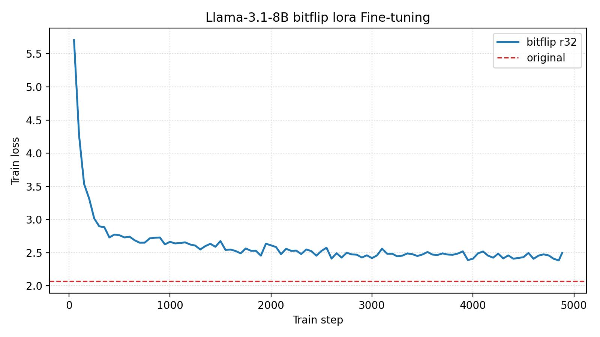

# Bitflip-Aware LoRA Fine-Tuning

This tutorial walks through how to run bitflip-aware LoRA fine-tuning on a pretrained LLM (e.g., `unsloth/Llama-3.1-8B`) using our custom training script.

## Overview

Bitflip-aware LoRA fine-tuning combines two ideas:

1. **Random Bitflip Simulation** — During the forward pass, random bit flips are injected into both activations and weights of every linear layer (except `lm_head`). This emulates hardware-level bit errors that occur in approximate or unreliable compute substrates.
2. **Low-Rank Adaptation (LoRA)** — Instead of fine-tuning all parameters, we attach small low-rank matrices (`lora_A`, `lora_B`) to each linear layer and only train those. The original pretrained weights are frozen.

By fine-tuning with bitflip noise injected during training, the LoRA adapters learn to compensate for hardware-induced errors, making the model more resilient at inference time.

### How It Works

Each `nn.Linear` layer in the model is replaced by a [`BitFlipLinearLora`](https://github.com/AICrossSim/NewComputeBench/blob/master/src/aixsim_models/bitflip/fine_tune/bitflip_lora.py) layer. The forward pass of `BitFlipLinearLora` performs the following:

```
Y = bitflip(X) @ bitflip(W + B @ A * scaling)^T
```

where:

- `X` is the input activation (with optional bitflip noise).
- `W` is the frozen pretrained weight.
- `A` (`lora_A`) and `B` (`lora_B`) are the trainable low-rank matrices.
- `scaling = lora_alpha / r` controls the magnitude of the LoRA update.
- `bitflip(·)` applies random bit flips to the sign-exponent and mantissa bits of the FP32 representation, controlled by per-component probabilities.

The model transformation is handled by the [`transform_llama`](https://github.com/AICrossSim/NewComputeBench/blob/master/src/aixsim_models/bitflip/fine_tune/bitflip_llama.py) function, which iterates over all `nn.Linear` modules in the model (excluding `lm_head`) and replaces them with `BitFlipLinearLora`.

### Entry Points

| File | Description |
|------|-------------|
| [`experiments/llm-bitflip/lora_finetune/run_clm_no_trainer.py`](https://github.com/AICrossSim/NewComputeBench/blob/master/experiments/llm-bitflip/lora_finetune/run_clm_no_trainer.py) | Main training script (HuggingFace Accelerate-based, no Trainer) |
| [`experiments/llm-bitflip/lora_finetune/fine-tune-bitflip-clm.sh`](https://github.com/AICrossSim/NewComputeBench/blob/master/experiments/llm-bitflip/lora_finetune/fine-tune-bitflip-clm.sh) | Shell wrapper that computes training steps and launches the run |
| [`experiments/llm-bitflip/lora_finetune/transform_cfg.toml`](https://github.com/AICrossSim/NewComputeBench/blob/master/experiments/llm-bitflip/lora_finetune/transform_cfg.toml) | Bitflip + LoRA configuration file |

## Step-by-Step Guide

!!! info "Environment Setup"

    If you have not set up environments, please follow the guidelines in [Environment Setup](../env-setup.md).

### 1. Configure the Bitflip & LoRA Transform

The transform configuration is defined in a TOML file. Here is the default configuration at [`experiments/llm-bitflip/lora_finetune/transform_cfg.toml`](https://github.com/AICrossSim/NewComputeBench/blob/master/experiments/llm-bitflip/lora_finetune/transform_cfg.toml):

```toml
use_lora = true

[fc]
    w_p_exp = 1.52587890625e-05
    w_p_frac = 1.52587890625e-05
    w_zero_out_t = 1.25
    x_p_exp = 1.52587890625e-05
    x_p_frac = 1.52587890625e-05
    x_zero_out_t = 30.0

[lora]
    r = 32
    lora_alpha = 32
```

**Configuration parameters:**

| Section | Parameter | Description |
|---------|-----------|-------------|
| (top-level) | `use_lora` | Enable LoRA adaptation (`true`/`false`). When `false`, all parameters are trained. |
| `[fc]` | `w_p_exp` | Bitflip probability for the sign-exponent bits of the **weight**. |
| `[fc]` | `w_p_frac` | Bitflip probability for the mantissa bits of the **weight**. |
| `[fc]` | `w_zero_out_t` | Threshold for zeroing out weight outliers / NaN values. |
| `[fc]` | `x_p_exp` | Bitflip probability for the sign-exponent bits of the **activation**. |
| `[fc]` | `x_p_frac` | Bitflip probability for the mantissa bits of the **activation**. |
| `[fc]` | `x_zero_out_t` | Threshold for zeroing out activation outliers / NaN values. |
| `[lora]` | `r` | LoRA rank. |
| `[lora]` | `lora_alpha` | LoRA scaling factor (effective scaling = `lora_alpha / r`). |

!!! note "Bitflip probability"
    The bitflip probability must be a power of 0.5 (e.g., `0.5^16 ≈ 1.526e-05`). The kernel automatically snaps to the nearest valid value. Due to limitations of the Philox PRNG, the minimum supported probability is `0.5^24 ≈ 5.96e-08`. See the [mase-triton docs](../02-model-behaviour-level-simulation/mase-triton.md) for more details.

### 2. Understand the Training Budget

The shell script [`fine-tune-bitflip-clm.sh`](https://github.com/AICrossSim/NewComputeBench/blob/master/experiments/llm-bitflip/lora_finetune/fine-tune-bitflip-clm.sh) automatically calculates the number of training steps based on a budget of **1% of the model's parameter count in tokens**. For `unsloth/Llama-3.1-8B` (8B parameters):

```
fine-tune tokens = 8,000,000,000 / 100 = 80,000,000 tokens
tokens per step  = num_gpus × per_device_batch_size × block_size
max_train_steps  = fine-tune tokens / tokens per step
```

For example, with 8 GPUs, batch size 1, and block size 2048:

```
tokens per step = 8 × 1 × 2048 = 16,384
max_train_steps = 80,000,000 / 16,384 ≈ 4,883 steps
```

### 3. Launch the Fine-Tuning

```bash
cd experiments/llm-bitflip/lora_finetune
```

The script accepts positional arguments to override defaults:

```bash
./fine-tune-bitflip-clm.sh [num_processes] [model_name_or_path] [per_device_train_batch_size] [learning_rate] [weight_decay] [gradient_accumulation_steps] [block_size]
```

**Example: Fine-tune Llama-3.1-8B on 8 GPUs with default settings**

```bash
./fine-tune-bitflip-clm.sh 8 unsloth/Llama-3.1-8B 1 1e-5 0.01 2 2048
```

This is equivalent to running the underlying command directly:

```bash
uv run accelerate launch --num_processes=8 \
    run_clm_no_trainer.py \
    --model_name_or_path unsloth/Llama-3.1-8B \
    --dataset_name Cheng98/fineweb-edu-1.25B \
    --per_device_train_batch_size 1 \
    --per_device_eval_batch_size 1 \
    --learning_rate 1e-5 \
    --weight_decay 0.01 \
    --num_train_epochs 1 \
    --gradient_accumulation_steps 2 \
    --lr_scheduler_type linear \
    --output_dir ./output/Llama-3.1-8B-bitflip-lora \
    --preprocessing_num_workers 32 \
    --trust_remote_code \
    --with_tracking \
    --report_to wandb \
    --transform_cfg ./transform_cfg.toml \
    --block_size 2048 \
    --log_train_loss_steps 50 \
    --max_train_steps 4883 \
    --wandb_tags unsloth/Llama-3.1-8B,lr1e-5,steps4883
```

**Key arguments:**

| Argument | Description |
|----------|-------------|
| `--model_name_or_path` | HuggingFace model identifier or local path. |
| `--dataset_name` | Training dataset. We use a 1.25B-token subset of [FineWeb-Edu](https://huggingface.co/datasets/Cheng98/fineweb-edu-1.25B). |
| `--transform_cfg` | Path to the TOML config for bitflip + LoRA. |
| `--block_size` | Context length for training samples. |
| `--log_train_loss_steps` | Log training loss to W&B every N steps. |
| `--max_train_steps` | Total number of optimizer steps (auto-calculated by the shell script). |

!!! tip "Adjusting GPU count"
    The first argument to `fine-tune-bitflip-clm.sh` controls `--num_processes` for `accelerate launch`. The script automatically recalculates `max_train_steps` to maintain the same total token budget regardless of the number of GPUs.

### 4. Monitor Training

If you have W&B set up (`wandb login`), training loss and validation perplexity are logged automatically. The training logs to the W&B project `Bitflip-CLM-Fine-tune`.

- **Training loss** is logged every 50 steps (configurable via `--log_train_loss_steps`).
- **Validation perplexity** is evaluated at the end of each epoch on the first 64 batches of the validation set.

### 5. Output

After training completes, the fine-tuned model (with LoRA weights merged into the base model) and tokenizer are saved to the output directory:

```
./output/Llama-3.1-8B-bitflip-lora/
├── config.json
├── model.safetensors
├── tokenizer.json
├── tokenizer_config.json
└── all_results.json         # Final perplexity
```

## Results

### Training Curves

{ width=720px }


| Metric | Value |
|--------|-------|
| Final Training Loss ($\downarrow$) | *2.50* |
| Final Validation Perplexity ($\downarrow$) | *11.01* |
| Total Training Steps | *4883* |

### Comparison with Baselines

We evaluate the model under three conditions:

| Bitflipped | Fine-tuned | Bitflip Config | Fine-tune Config |  Val PPL ($\downarrow$) |
|-------|---------------|------------------| ---------| ----|
| ✘ | ✘ | N/A | N/A |  *7.91* |
| ✔ | ✘ | `w/x_p_exp=1.53e-5, w/x_p_frac=1.53e-5`| N/A | *1008.95*  |
| ✔ | ✔ | `w/x_p_exp=1.53e-5, w/x_p_frac=1.53e-5` | Lora rank=32 |  *11.01* |

From the table above, we can see that *Lora fine-tuning effectively mitigates the impact of bitflip noise, reducing perplexity from 1008.95 to 11.01* for a 7B model.

We can also safely assume that with more trainable parameters (e.g., a larger LoRA rank, or full fine-tuning) the model would be able to compensate for the noise even better.

### Resources

| Resource | Link |
|----------|------|
| W&B Logs | *https://wandb.ai/cz98/Bitflip-CLM-Fine-tune* |
| Training Config | [`transform_cfg.toml`](https://github.com/AICrossSim/NewComputeBench/blob/master/experiments/llm-bitflip/lora_finetune/transform_cfg.toml) |

## Appendix: Evaluation Scripts

The comparison table above was generated with two evaluation-only wrappers that reuse `run_clm_no_trainer.py` but bypass any optimizer steps. Both scripts share the signature `./script.sh [num_processes] [model_name_or_path] [per_device_batch_size] [block_size] [eval_max_steps]` so you can sweep models or batch sizes without editing Python code.

| Script | Purpose | Notes |
|--------|---------|-------|
| [`experiments/llm-bitflip/lora_finetune/eval-bitflip-no-finetune.sh`](https://github.com/AICrossSim/NewComputeBench/blob/master/experiments/llm-bitflip/lora_finetune/eval-bitflip-no-finetune.sh) | Measures perplexity when random bitflips are injected during inference. | This is biflipped (✔) fine-tuned (✘) entry |
| [`experiments/llm-bitflip/lora_finetune/eval-no-biflip-no-finetune.sh`](https://github.com/AICrossSim/NewComputeBench/blob/master/experiments/llm-bitflip/lora_finetune/eval-no-biflip-no-finetune.sh) | Serves as the clean baseline (no injected bitflips, no finetuning) so we can isolate the effect of noise. | This is biflip-free (✘) fine-tuned (✘) entry |
