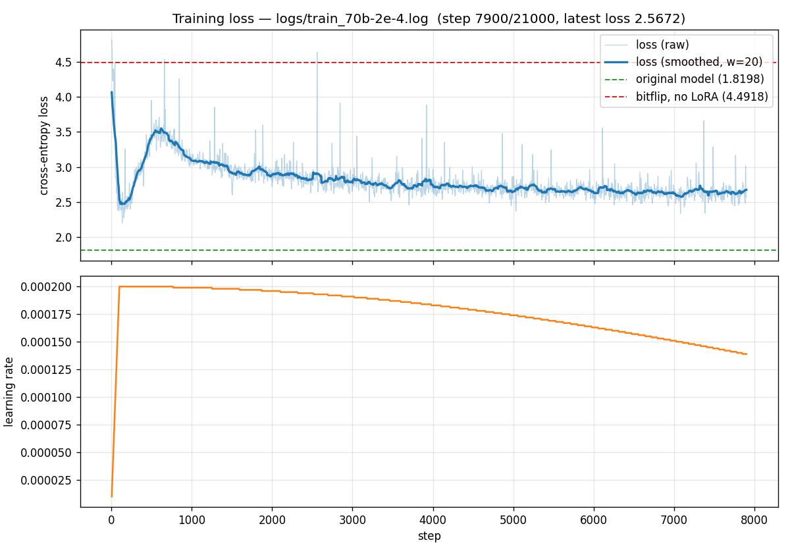

Bitflip-Aware LoRA Fine-Tuning with FSDP2 (Llama-3-70B)
========================================================

This tutorial covers bitflip-aware LoRA fine-tuning of **Llama-3-70B** using
**FSDP2** (``torch.distributed.fsdp.fully_shard``) and ``torchtitan`` model
definitions. It scales the approach in :doc:`bitflip_lora` from a 7B–8B model
to a 70B model on a small B200 node.

.. note::

   If you have not set up the environment yet, follow
   :doc:`../../getting_started/installation` first. The FSDP2 path also requires
   a recent PyTorch nightly — see Step 0 below.

Overview
--------

The setup is the same as :doc:`bitflip_lora`:

1. **Random Bitflip Simulation** — random bit flips are injected during the
   forward pass into both activations and weights of every Linear layer
   (except ``lm_head``).
2. **Low-Rank Adaptation (LoRA)** — small ``lora_A`` / ``lora_B`` matrices are
   attached to each Linear; only these are trained, the pretrained weights stay
   frozen.

The two differences from :doc:`bitflip_lora` are:

* **Model build path** — instead of ``transformers.AutoModelForCausalLM``, the
  model is built from ``torchtitan``'s Llama-3 definitions on a ``meta`` device
  and then materialised; this is required to fit a 70B model under FSDP2.
* **Sharding** — parameters, gradients, and optimizer state are sharded across
  GPUs with FSDP2 (``fully_shard``), with bf16 forward and fp32 reductions.

How It Works
~~~~~~~~~~~~

Each ``nn.Linear`` is replaced by a ``BitFlipLinearLora`` whose forward computes

.. math::

   Y = \text{bitflip}(X) \cdot \text{bitflip}(W + B \cdot A \cdot \text{scaling})^T

where :math:`X` is the input activation, :math:`W` is the frozen pretrained
weight, :math:`A` / :math:`B` are the trainable low-rank matrices,
:math:`\text{scaling} = \text{lora\_alpha} / r`, and :math:`\text{bitflip}(\cdot)`
applies random bit flips with configurable per-component probabilities.

The transform is applied by ``BitFlipLoRAConverter`` (from
``aixsim_models.bitflip.lora_finetune_fsdp.converter``), which replaces all
``nn.Linear`` modules (excluding ``output`` / lm_head) with
``BitFlipLinearLora`` after the meta model is constructed and before FSDP2
sharding.

Entry Points
~~~~~~~~~~~~

.. list-table::
   :header-rows: 1
   :widths: 55 45

   * - File
     - Description
   * - `experiments/llm-bitflip/lora_finetune_fsdp/train.py <https://github.com/AICrossSim/NewComputeBench/blob/master/experiments/llm-bitflip/lora_finetune_fsdp/train.py>`_
     - Standalone training script (torchrun + FSDP2, no HF Trainer / Accelerate).
   * - `experiments/llm-bitflip/lora_finetune_fsdp/eval.py <https://github.com/AICrossSim/NewComputeBench/blob/master/experiments/llm-bitflip/lora_finetune_fsdp/eval.py>`_
     - Forward-only eval (clean / ``--bitflip`` / ``--profile`` modes).
   * - `experiments/llm-bitflip/lora_finetune_fsdp/config_70b.toml <https://github.com/AICrossSim/NewComputeBench/blob/master/experiments/llm-bitflip/lora_finetune_fsdp/config_70b.toml>`_
     - 70B training + bitflip + LoRA configuration.
   * - `experiments/llm-bitflip/lora_finetune_fsdp/run.sh <https://github.com/AICrossSim/NewComputeBench/blob/master/experiments/llm-bitflip/lora_finetune_fsdp/run.sh>`_
     - Single-/multi-node ``torchrun`` launcher.
   * - `experiments/llm-bitflip/lora_finetune_fsdp/run_slurm.sh <https://github.com/AICrossSim/NewComputeBench/blob/master/experiments/llm-bitflip/lora_finetune_fsdp/run_slurm.sh>`_
     - SLURM batch wrapper around ``run.sh``.

Step-by-Step Guide
------------------

Step 0 — Environment
~~~~~~~~~~~~~~~~~~~~

FSDP2 (``fully_shard``) requires a recent PyTorch. This experiment vendors
``torchtitan`` (commit ``0e0590c1``) inside the experiment directory and adds
it to ``sys.path``, so it does **not** rely on the project's
``submodules/torchtitan`` pin. To create an isolated venv with PyTorch
nightly, Triton, and the vendored ``torchtitan``::

   cd experiments/llm-bitflip/lora_finetune_fsdp
   bash setup_env.sh
   source .venv/bin/activate

.. note::

   ``train.py`` / ``eval.py`` add the repo's ``src/`` and the vendored
   ``torchtitan/`` to ``sys.path`` at import time, so the project does **not**
   need to be installed (``pip install -e .`` not required). Just make sure
   PyTorch, Triton, and the other dependencies from ``setup_env.sh`` are
   available in the active environment.

Step 1 — Configure Bitflip, LoRA, and Training
~~~~~~~~~~~~~~~~~~~~~~~~~~~~~~~~~~~~~~~~~~~~~~

The 70B run is fully configured by a single TOML file
(``config_70b.toml``):

.. code-block:: toml

   [model]
   flavor = "70B"
   hf_model_path = "meta-llama/Meta-Llama-3-70B"

   [training]
   dtype = "bfloat16"
   mixed_precision_param = "bfloat16"
   mixed_precision_reduce = "float32"
   seq_len = 2048
   local_batch_size = 2
   gradient_accumulation_steps = 4
   steps = 20  # override with --steps for full run
   lr = 2e-4
   weight_decay = 0.01
   warmup_steps = 100
   max_norm = 1.0
   log_freq = 5
   save_freq = 500

   [parallelism]
   fsdp_degree = 4

   [lora]
   r = 32
   lora_alpha = 32

   [bitflip]
   w_p_exp      = 1.52587890625e-05   # 0.5^16
   w_p_frac     = 1.52587890625e-05   # 0.5^16
   w_zero_out_t = 256.0               # > profiled |w| max (126.5)
   x_p_exp      = 1.52587890625e-05   # 0.5^16
   x_p_frac     = 1.52587890625e-05   # 0.5^16
   x_zero_out_t = 8192.0              # > profiled |x| max (3680)
   base_seed    = 0
   skip_patterns = ["output"]         # lm_head is not perturbed

.. list-table:: Key parameters
   :header-rows: 1
   :widths: 18 22 60

   * - Section
     - Parameter
     - Description
   * - ``[parallelism]``
     - ``fsdp_degree``
     - FSDP2 shard size. ``4`` means parameters/grads/opt-state are sharded across
       4 GPUs per replica.
   * - ``[training]``
     - ``mixed_precision_param`` / ``_reduce``
     - bf16 parameters, fp32 gradient reductions — the standard FSDP2 large-model
       recipe.
   * - ``[lora]``
     - ``r``, ``lora_alpha``
     - LoRA rank and scaling (effective scaling = ``lora_alpha / r``). ``r = 0``
       disables LoRA entirely (used by the no-LoRA bitflip eval).
   * - ``[bitflip]``
     - ``w_zero_out_t`` / ``x_zero_out_t``
     - Thresholds above which a value is set to 0 after the flip — a guard
       against exponent-flip blowups. See Step 2 below.
   * - ``[bitflip]``
     - ``skip_patterns``
     - Layer-name substrings to leave un-bitflipped. ``"output"`` excludes the
       lm_head.

.. note::

   Bitflip probabilities must be a power of 0.5 (e.g., ``0.5^16 ≈ 1.526e-5``);
   the Triton kernel snaps to the nearest valid value. See :doc:`mase_triton`.

Step 2 — Profile and Set ``zero_out`` Thresholds
~~~~~~~~~~~~~~~~~~~~~~~~~~~~~~~~~~~~~~~~~~~~~~~~

``zero_out`` thresholds must sit **above** the clean model's legitimate range
so that the clip catches only flip-corrupted blowups, never real signal.

Profile with ``eval.py --profile`` over a few dozen sequences:

.. code-block:: bash

   torchrun --nproc_per_node=4 eval.py --config config_70b.toml \
       --num-samples 64 --profile

For Llama-3-70B (64 sequences, 131k tokens, 560 bitflip-eligible Linear
layers) the profile is:

.. list-table:: Activation / weight magnitude profile
   :header-rows: 1
   :widths: 18 12 12 12 12 18

   * - Tensor
     - p50
     - p99
     - p99.9
     - p99.99
     - global max
   * - Activations (Linear inputs)
     - 0.031
     - 0.5
     - 2
     - 4
     - **3680**
   * - Weights (``.weight``)
     - 0.016
     - 0.063
     - 0.063
     - 0.125
     - **126.5**

A few late-layer ``w2`` inputs carry huge values (the "massive activations"
seen in Llama-3) — these are legitimate, so the activation threshold must sit
above 3680. The 70B config uses ``w_zero_out_t = 256.0`` and
``x_zero_out_t = 8192.0``.

.. warning::

   An earlier config used ``w_zero_out_t = 1.25`` and ``x_zero_out_t = 30``.
   The profile showed these clip legitimate values, and a test run confirmed it:
   training loss exploded to 9.72 by step 5 (perplexity ~16,000) **before any
   flip occurred**. Always profile before changing thresholds.

Step 3 — Launch Training
~~~~~~~~~~~~~~~~~~~~~~~~

The full 70B run targets ~21,000 optimizer steps (≈ 1% of 70B parameters in
training tokens, ≈ 700M tokens):

.. code-block:: bash

   cd experiments/llm-bitflip/lora_finetune_fsdp
   bash run.sh config_70b.toml

which expands to (single 8-GPU node):

.. code-block:: bash

   torchrun --nproc_per_node=8 --nnodes=1 \
       --master_addr=localhost --master_port=29500 \
       train.py --config config_70b.toml

To override the step count from the command line:

.. code-block:: bash

   torchrun --nproc_per_node=8 train.py --config config_70b.toml --steps 21000

For multi-node, set ``MASTER_ADDR`` / ``NNODES`` / ``NODE_RANK`` env vars per
``run.sh`` usage notes, or submit ``run_slurm.sh`` to SLURM.

Step 4 — Evaluate
~~~~~~~~~~~~~~~~~

``eval.py`` is forward-only and supports three modes:

.. code-block:: bash

   # Clean baseline (no bitflip, no LoRA)
   torchrun --nproc_per_node=4 eval.py --config config_70b.toml --num-samples 256

   # Bitflip ON, r=0 (no LoRA), no retraining
   torchrun --nproc_per_node=4 eval.py --config config_70b.toml --num-samples 256 --bitflip

   # Profile activations + weights to choose zero-out thresholds
   torchrun --nproc_per_node=4 eval.py --config config_70b.toml --num-samples 64 --profile

Evaluation is the first *N* sequences of the training set, ``seq_len = 2048``
chunks, token-weighted mean cross-entropy; ``perplexity = exp(loss)``.

Results
-------

All numbers below are for ``meta-llama/Meta-Llama-3-70B`` (70B, bf16) on
4 × NVIDIA B200 with ``fsdp_degree = 4``, training data
``Cheng98/fineweb-edu-1.25B``.

Baseline — Clean Model
~~~~~~~~~~~~~~~~~~~~~~

Original model, no bitflip, no LoRA (``logs/eval_baseline.log``):

.. list-table::
   :header-rows: 1
   :widths: 25 25 25 25

   * - Sequences
     - Tokens
     - Loss (CE)
     - Perplexity
   * - 256
     - 524,288
     - **1.8198**
     - **6.17**

Bitflip On, No LoRA, No Retraining
~~~~~~~~~~~~~~~~~~~~~~~~~~~~~~~~~~~

Same 256 sequences, ``r = 0``, seed 0, all 560 eligible Linear layers
perturbed (``logs/eval_bitflip.log``):

.. list-table::
   :header-rows: 1
   :widths: 60 20 20

   * - Condition
     - Loss (CE)
     - Perplexity
   * - Clean (reference)
     - 1.8198
     - 6.17
   * - Bitflip — exp + frac, on weights & activations (``0.5^16``)
     - **4.4918**
     - **89.28**

Observations: Adding **exponent-bit flips and activation flips** degrades perplexity from 6.17 → 89.28 (~14×). The degradation is large but coherent — far from the ~16,000 of the bad-threshold run — so there is meaningful headroom for LoRA to recover.

Bitflip-Aware LoRA Retraining (lr = 2e-4)
~~~~~~~~~~~~~~~~~~~~~~~~~~~~~~~~~~~~~~~~~

Training was run with ``r = 32``, ``lora_alpha = 32``, ``lr = 2e-4``,
``warmup = 100``, ``weight_decay = 0.01``, ``seq_len = 2048``,
``local_batch_size = 2``, ``grad_accum = 4`` (effective batch = 32
sequences). The original step budget was 21,000; training was **stopped
early at 7,900 steps** once the loss had clearly converged — the run had
already demonstrated that bitflip-aware LoRA scales to 70B with the same
recipe used for 8B, so the remaining budget was not needed
(``logs/train_70b.log``).

   Training loss for the 70B run at ``lr = 2e-4`` (early-stopped at 7,900
   steps after convergence).

.. list-table::
   :header-rows: 1
   :widths: 60 40

   * - Metric
     - Value
   * - Training steps completed
     - **7,900** (early-stopped; original target 21,000)
   * - Final training loss
     - ~2.5 – 2.7 (converged)
   * - Tokens/s
     - ~1,095

The headline result: with bitflip noise injected into every eligible Linear
layer, training loss converges from the bitflip-only ceiling
(CE ≈ 4.49 / PPL ≈ 89.28) down to ~2.5 – 2.7. The bitflip-aware LoRA recipe
transfers cleanly from 8B to 70B without changes to the kernel, converter,
or optimizer setup. Scaling up this experiment, e.g., a higher lora rank ``r`` with more fine-tuning steps or full fine-tuning with bitflip, is very likely to further recover the model performance.

.. note::

   This is the only learning rate kept in this tutorial; other learning rates
   (``1e-4``, ``1e-5``) explored during sweeps are omitted.

Resources
~~~~~~~~~

- Training log: ``experiments/llm-bitflip/lora_finetune_fsdp/logs/train_70b.log``
- Training curve: ``experiments/llm-bitflip/lora_finetune_fsdp/logs/train_70b_loss.png``
- Baseline / bitflip eval logs:
  ``logs/eval_baseline.log``,
  ``logs/eval_bitflip.log``,
  ``logs/profile.log``
- Training config:
  `config_70b.toml <https://github.com/AICrossSim/NewComputeBench/blob/master/experiments/llm-bitflip/lora_finetune_fsdp/config_70b.toml>`_
